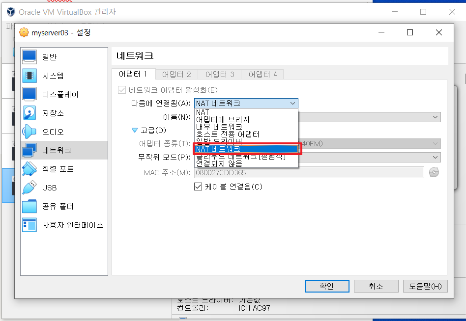
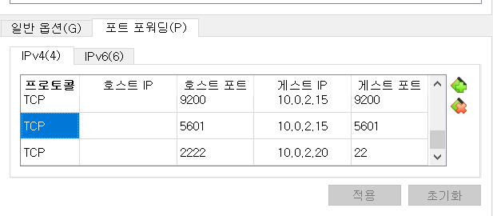
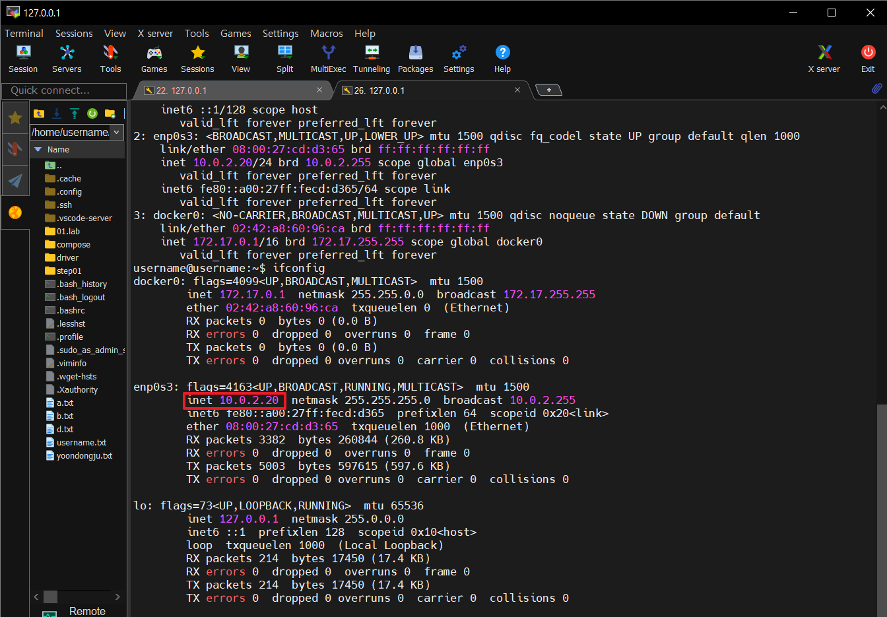
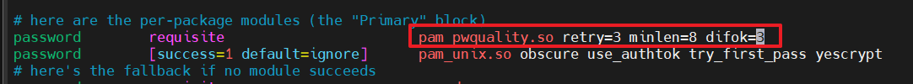
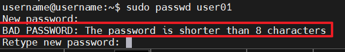

# 🕶Linux PAM 모듈로 보안정책 구성하기

### 🎨PAM(Pluggable Authentiaction Modules)

- 리눅스 시스템에서 사용자의 인증을 담당하는 모듈로 비밀번호를 8자리이상만 허용하도록 설정한다.

### 😮새로운 VM 생성 및 고정IP 할당

```java
sudo vi /etc/netplan/00-installer-config.yaml
```

**고정할 IP주소 설정**

```java
network:
  version: 2
  renderer: networkd
  ethernets:
    enp0s3:
      addresses:
        - 10.0.2.20/24  # 변경된 고정 IP 주소
      routes:
        - to: default
          via: 10.0.2.1  # 게이트웨이
      nameservers:
        addresses:
          - 8.8.8.8
      dhcp4: false
```



- NAT 네트워크로 네트워크 변경


**공용 NAT 설정**



- 2222번으로 VM(Server03) SSH 설정



- 호스트에서 Server03 접속 후 10.0.2.20 아이피변경 확인

### ✌PAM의 사용이유

- **보안이 중요한 명령어**
    - `passwd`와 같은 명령어는 사용자가 시스템에 로그인한 후에도 추가 인증이 필요했고,  원격 사용자와 상호작용하는 서버 데몬들도 사용자를 인증을 해야했다.
- **초기 Unix 방식**
    - 처음에는 인증이 필요한 모든 프로그램이 `/etc/passwd` 파일을 직접 읽어 사용자 정보를 확인했다. 하지만 시간이 지나면서 이 파일의 포맷이 바뀌었고, 비밀번호 만료 기능 같은 새로운 정보가 추가되면서 모든 프로그램이 이를 처리할 수 있는 방법이 필요했음.
- **단일 사용자 데이터베이스**
    - 큰 조직에서는 중앙 인증 시스템(예: **NIS**, Network Information Service)을 사용하기 시작했습니다. 이로 인해 `yppasswd`와 같은 NIS 관련 명령어들이 생겨났고, 시스템 관리가 더욱 복잡해졌다.
- **새로운 기술의 등장**
    - **섀도우 비밀번호**, **Kerberos**, **MD5**와 같은 새로운 인증 기술들이 도입되었으며, 이때마다 프로그램을 다시 작성하거나 수정해야 했다.

### 🚘PAM의 기본 구조

PAM은 시스템 관리자가 특정 프로그램(애플리케이션 또는 데몬)에 대해 접근 정책을 설정할 수 있는 구성 파일을 사용한다. 이 구성 파일은 PAM 모듈을 나열한 리스트이며, 이 리스트를 스택(stack)이라고 부른다.

PAM의 강점은 다양한 모듈을 사용하여 유연하게 인증 및 보안 정책을 적용할 수 있다. 시스템 관리자는 각 프로그램에 대해 원하는 방식으로 인증 방식을 설정할 수 있으며, 프로그램 자체를 수정할 필요 없이 PAM 구성 파일만 업데이트하면 된다.

- 여러 모듈을 동시에 사용할 수 있고, 한 모듈이 실패하면 다음 모듈로 넘어가는 등 복잡한 보안 정책도 구현할 수 있다.
- PAM은 단순한 인증뿐만 아니라, 세션 설정 및 종료, 로그 기록, 자원 사용 제한 등 다양한 기능을 처리할 수 있다.

### 🏃‍♂️예시

```bash
auth       required     pam_securetty.so
auth       required     pam_unix.so nullok
auth       optional     pam_tally.so onerr=fail
account    required     pam_unix.so
password   required     pam_cracklib.so retry=3 minlen=8 difok=3
session    required     pam_limits.so
session    optional     pam_lastlog.so
session    optional     pam_mail.so
```

<aside>

- `auth required pam_securetty.so`: 사용자가 `root`로 로그인할 때 `securetty` 파일에 정의된 터미널에서만 로그인할 수 있습니다.
- `auth required pam_unix.so nullok`: Unix 시스템의 사용자 비밀번호를 확인합니다. `nullok` 옵션은 비밀번호가 없는 계정도 허용합니다.
- `auth optional pam_tally.so onerr=fail`: 로그인 실패 횟수를 추적합니다. 오류가 발생하면 인증을 실패로 처리합니다.
- `account required pam_unix.so`: 사용자의 계정 상태를 확인합니다.
- `password required pam_cracklib.so retry=3 minlen=8 difok=3`: 비밀번호 정책을 설정합니다. 사용자는 최소 8자리의 비밀번호를 3번까지 시도할 수 있으며, 이전 비밀번호와 3글자 이상 달라야 합니다.
- `session required pam_limits.so`: 세션 자원 제한을 설정합니다. 예를 들어, 파일 개수나 프로세스 수 제한을 설정할 수 있습니다.
- `session optional pam_lastlog.so`: 사용자의 마지막 로그인 시간을 기록합니다.
- `session optional pam_mail.so`: 사용자가 로그인할 때 새로운 메일이 있는지 확인합니다.
</aside>

### 🍘VM Server03에 PAM 적용하기

**추가 라이브러리 설치**

```bash
sudo apt install libpam-pwquality
```

```bash
sudo vi /etc/pam.d/common-password
```

**설정**



- **`retry=3`**: 사용자가 비밀번호 입력에 실패할 때 3번까지 재시도 가능
- **`minlen=8`**: 비밀번호의 최소 길이를 8자로 설정
- **`difok=3`**: 이전 비밀번호와 최소 3글자 이상 달라야한다.

### **로그 파일 확인 및 설정**

PAM 설정 후 문제가 발생할 수 있으므로, 시스템 로그를 통해 PAM 관련 오류를 확인해야함.

- PAM 관련 오류는 **/var/log/auth.log** 파일에 기록된다. 설정이 제대로 적용되지 않거나 문제가 발생했을 때 이 로그 파일에서 원인을 찾아볼 수 있다.

```bash

sudo tail -f /var/log/auth.log
```

### 👌테스트

PAM 설정을 변경한 후, 해당 설정이 정상적으로 동작하는지 꼭 테스트해야 한다. 잘못된 설정은 시스템에 로그인이 불가능하게 만들 수 있으므로, `SSH` 세션이나 다른 터미널을 열어두고 설정을 테스트하는 것이 좋다.

1. **SSH 세션 열기**
    - SSH 세션을 열어두면 PAM 설정 중 실수로 인해 로그인 세션이 종료되더라도 복구할 수 있다.
2. **설정 테스트**
    - 설정이 정상적으로 적용되는지 확인하려면 직접 로그아웃 및 로그인하거나, 비밀번호 변경, sudo 명령어 등을 사용해 변경 사항을 테스트할 수 있다.
3. **설정 파일 저장 후 테스트**



- 정상적으로 비밀번호 8자리 이상 입력해야 비밀번호가 변경되도록 정책이 변경 되었다.

### 😊결론 및 추후 공부방향

PAM은 여러 애플리케이션에서 인증을 관리하기 위해 다양한 설정 파일을 사용함. 이러한 설정 파일들은 주로 `/etc/pam.d/` 디렉터리에 위치하며, 각 프로그램(로그인, 비밀번호 변경, sudo 등)에 대한 개별적인 PAM 정책을 정의한다. 주요 구성 파일을 이해하는 것이 중요

각 서비스별 PAM 설정 파일이 들어 있는 디렉터리

- `/etc/pam.d/login`: 로그인 관련 인증 정책.
- `/etc/pam.d/sshd`: SSH 접속을 위한 PAM 정책.
- `/etc/pam.d/common-auth`: 시스템 전반에서 사용되는 공통 인증 정책.
- `/etc/pam.d/common-password`: 비밀번호 변경 정책.

지금은 기본적인 내용을 구현해보며 기능을 익혔지만 추후 공식문서를 꼼꼼히 읽어보고 설정파일들의 역할과 모듈에 대해 더욱 숙지할 필요가 있음을 느꼈다.